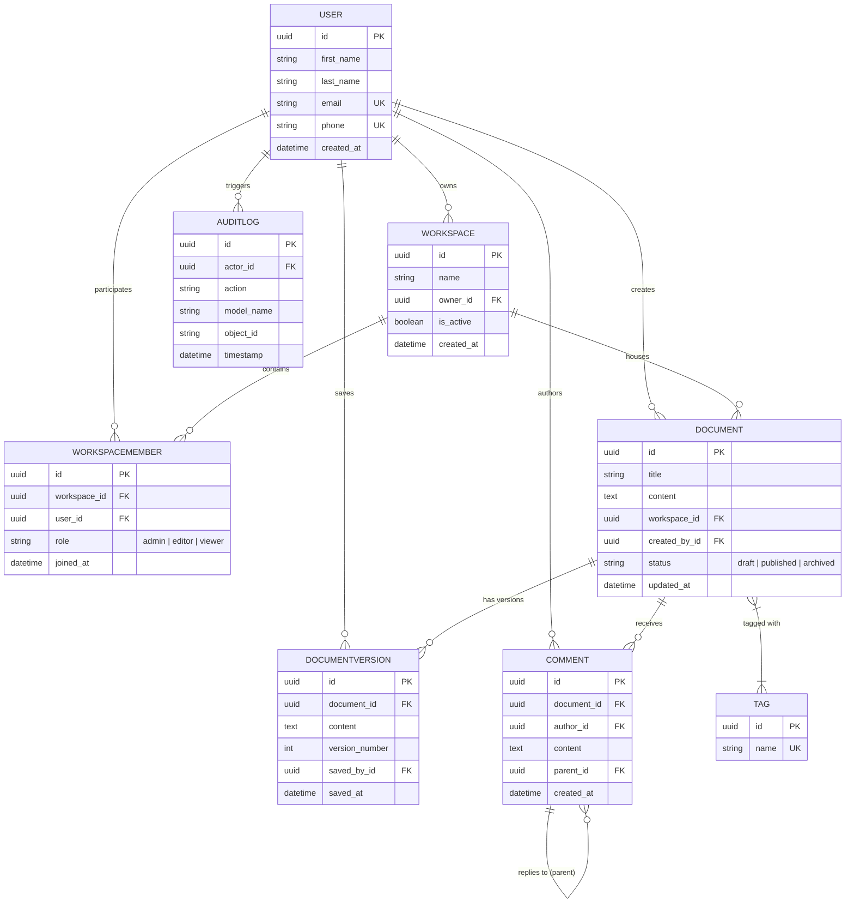

# CollabDocs - Collaborative Document Platform API

CollabDocs is a production-ready, highly robust backend RESTful API built with **Django** and **Django REST Framework (DRF)**. It enables users to manage collaborative workspaces, document versioning, threaded comments, tag classification, automated audit logs, and member permissions with rule-based access controls.

---

## 📚 Detailed Documentation

Comprehensive documentation files are organized in the `docs/` folder:

- **Setup & Local Execution**: See [docs/SETUP_GUIDE.md](docs/SETUP_GUIDE.md) for local installation, Docker Compose setup, test runner commands, and Postman import instructions.
- **API Endpoint Reference**: See [docs/API_DOCUMENTATION.md](docs/API_DOCUMENTATION.md) for detailed request/response payloads, query parameters, and status codes across all 17 RESTful endpoints.
- **System Architecture & ERD**: See [docs/ARCHITECTURE.md](docs/ARCHITECTURE.md) for database model definitions, ERD diagrams, atomic transaction flow, custom request logging middleware, and audit log signals.
- **CI/CD Pipeline Architecture**: See [docs/CICD_PIPELINES.md](docs/CICD_PIPELINES.md) for details on GitHub Actions reusable workflow templates (`lint`, `test`, `build`, `release`).
- **Modular Terraform Infrastructure**: See [docs/INFRASTRUCTURE_TERRAFORM.md](docs/INFRASTRUCTURE_TERRAFORM.md) for AWS infrastructure code layout (`vpc`, `rds`, `app`), `dev`/`prod` environments, and deployment guides.

---

## 🌟 Key Architectural Features

- **8 Core Models**: `User`, `Workspace`, `WorkspaceMember`, `Document`, `DocumentVersion`, `Comment`, `Tag`, `AuditLog` with auto-generated UUID primary keys (`uuid.uuid4`).
- **Data Integrity & Atomic Transactions**: All workspace creation + member auto-assignment and document saves + version incrementing (`v1`, `v2`, ...) are wrapped inside strict `transaction.atomic()` blocks.
- **Automated Audit Logging**: Django `post_save` signal automatically tracks create and update actions on `Document` instances into `AuditLog`.
- **Custom Request Logging Middleware**: Middleware in [collabdocs/middleware.py](collabdocs/middleware.py) calculates and logs request duration in milliseconds along with HTTP method, endpoint path, and response status code.
- **Interactive Swagger & OpenAPI Documentation**: Powered by `drf-spectacular` with live interactive UI at `/api/schema/swagger-ui/` and Redoc at `/api/schema/redoc/`.
- **Templatized CI/CD Pipelines**: Modular GitHub Actions workflows in [.github/workflows/ci-cd.yml](.github/workflows/ci-cd.yml) using reusable workflow templates directly under [.github/workflows/](.github/workflows/).
- **Modular Terraform Infrastructure**: Enterprise Infrastructure-as-Code (IaC) setup with reusable modules for `VPC`, `RDS (PostgreSQL)`, and `ECS/APP` in [terraform/modules/](terraform/modules/) separated into `dev` and `prod` environments in [terraform/environments/](terraform/environments/).
- **Complete Postman Collection**: [CollabDocs.postman_collection.json](CollabDocs.postman_collection.json) containing ready-to-run requests for all 17 required API endpoints.

---

## 📐 Entity-Relationship Diagram (ERD)



---

## 🚀 API Endpoint Reference (17 Endpoints)

| Category | Method | Endpoint | Description & Detail Link |
| :--- | :--- | :--- | :--- |
| **Users** | `POST` | `/api/users/` | Create a user (`ModelViewSet`, custom phone/email validation). |
| | `GET` | `/api/users/{id}/` | Get user details by UUID. |
| **Workspaces** | `POST` | `/api/workspaces/` | Create workspace & auto-add owner as `admin` member (`transaction.atomic()`). |
| | `GET` | `/api/workspaces/{id}/` | Get workspace details annotated with `member_count`. |
| | `POST` | `/api/workspaces/{id}/members/` | Add member with role (`admin`, `editor`, `viewer`). Catches duplicate member -> `409 Conflict`. |
| | `GET` | `/api/workspaces/{id}/members/` | List members for workspace (`select_related('user')`). |
| | `GET` | `/api/workspaces/{id}/summary/` | Summary metrics: doc count, member count, comment count (`aggregate`, `annotate`). |
| **Documents** | `POST` | `/api/documents/` | Create document + initial version `v1` (`transaction.atomic()`). |
| | `PUT` | `/api/documents/{id}/` | Update document content + auto-create version `vN` (`transaction.atomic()`). |
| | `GET` | `/api/documents/` | List documents filtered by `workspace`, `status`, `tag_name`, and search `title` (`icontains`, `Q`). |
| | `GET` | `/api/documents/{id}/versions/` | List all historical versions of a document in ascending order (`v1`, `v2`, ...). |
| | `GET` | `/api/documents/{id}/stats/` | Document stats: version count, comment count, unique contributor count. |
| | `POST` | `/api/documents/{id}/tags/` | Add tags (by ID or name) to a document (`ManyToManyField.add()`). |
| **Comments** | `POST` | `/api/comments/` | Add top-level comment or threaded reply (`parent` self-referential FK). |
| | `GET` | `/api/comments/?document={id}` | List comments for a document (`select_related`, query params). |
| **Tags** | `POST` | `/api/tags/` | Create a unique tag (`TagSerializer` custom validation). |
| **Audit Logs** | `GET` | `/api/audit-logs/` | Query audit log entries filtered by `actor` ID and date range (`date_from`, `date_to`). |

Full API specifications are available in [docs/API_DOCUMENTATION.md](docs/API_DOCUMENTATION.md).

---

## 🛠 Quick Start & Testing

For full setup steps, environment configuration, and Postman testing, refer to [docs/SETUP_GUIDE.md](docs/SETUP_GUIDE.md).

### Run Test Suite

```bash
python manage.py test api
```

#### Example Local Test Output

```text
Found 26 test(s).
Creating test database for alias 'default'...
System check identified no issues (0 silenced).
[GET] /api/users/ - Status: 200 - Time taken: 0.39ms
...............[GET] /api/audit-logs/ - Status: 200 - Time taken: 32.37ms
.[POST] /api/comments/ - Status: 201 - Time taken: 5.80ms
[GET] /api/comments/ - Status: 200 - Time taken: 8.85ms
.[POST] /api/users/ - Status: 201 - Time taken: 2.51ms
[GET] /api/users/b42e76a1-69b3-43d8-9999-92a83420d1cd/ - Status: 200 - Time taken: 3.17ms
.[POST] /api/documents/ - Status: 201 - Time taken: 11.23ms
[PUT] /api/documents/f5a46e8f-c3ad-4dcf-b205-7403b32e5b3c/ - Status: 200 - Time taken: 11.12ms
.[GET] /api/documents/ - Status: 200 - Time taken: 9.75ms
[GET] /api/documents/ - Status: 200 - Time taken: 7.62ms
[GET] /api/documents/ - Status: 200 - Time taken: 11.50ms
.[GET] /api/documents/608ba5c2-7899-45fa-99a8-629dec543fd6/versions/ - Status: 200 - Time taken: 11.55ms
[GET] /api/documents/608ba5c2-7899-45fa-99a8-629dec543fd6/stats/ - Status: 200 - Time taken: 10.94ms
[POST] /api/documents/608ba5c2-7899-45fa-99a8-629dec543fd6/tags/ - Status: 200 - Time taken: 9.27ms
.[POST] /api/tags/ - Status: 201 - Time taken: 1.98ms
.[POST] /api/users/ - Status: 400 - Time taken: 1.94ms
.[POST] /api/workspaces/ - Status: 201 - Time taken: 4.50ms
.[GET] /api/workspaces/0f977bcc-7d61-4249-9cb1-f9d53df4230c/ - Status: 200 - Time taken: 5.61ms
[POST] /api/workspaces/0f977bcc-7d61-4249-9cb1-f9d53df4230c/members/ - Status: 201 - Time taken: 7.79ms
[POST] /api/workspaces/0f977bcc-7d61-4249-9cb1-f9d53df4230c/members/ - Status: 409 - Time taken: 4.62ms
[GET] /api/workspaces/0f977bcc-7d61-4249-9cb1-f9d53df4230c/members/ - Status: 200 - Time taken: 6.10ms
.[GET] /api/workspaces/5ab8ecec-7e66-4241-ba21-255e9991afd0/summary/ - Status: 200 - Time taken: 4.00ms
.
----------------------------------------------------------------------
Ran 26 tests in 0.409s

OK
Destroying test database for alias 'default'...
```

### Run Server

```bash
python manage.py runserver
```

---

## 📄 License

Distributed under the MIT License. See `LICENSE` for details.
