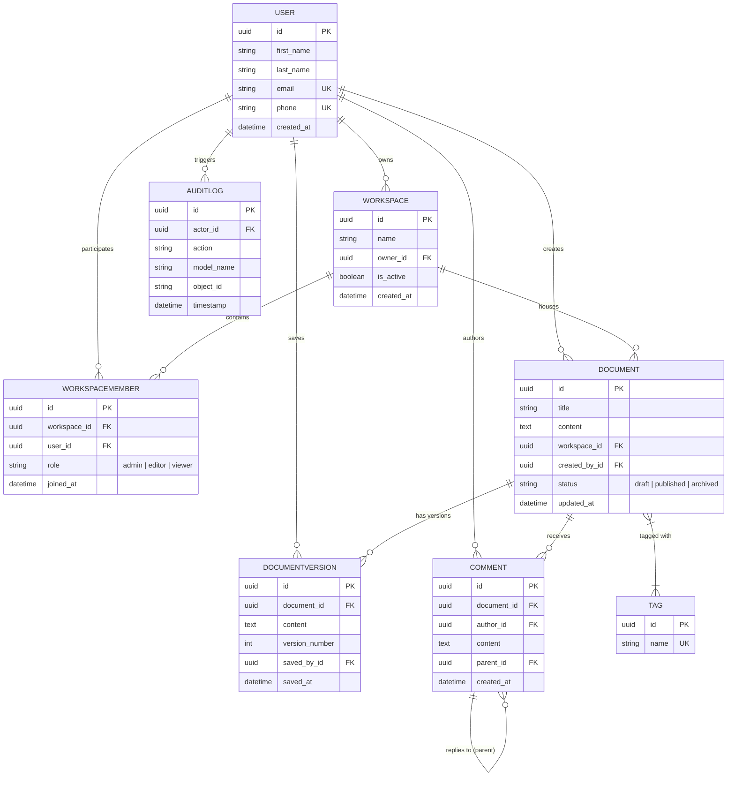

# CollabDocs - Collaborative Document Platform API

CollabDocs is a production-ready, highly robust backend RESTful API built with **Django** and **Django REST Framework (DRF)**. It enables users to manage collaborative workspaces, document versioning, threaded comments, tag classification, automated audit logs, and member permissions with rule-based access controls.

---

## 📚 Detailed Documentation

Comprehensive documentation files are organized in the `docs/` folder:

- **Setup & Local Execution**: See [docs/SETUP_GUIDE.md](docs/SETUP_GUIDE.md) for local installation, Docker Compose setup, test runner commands, and Postman import instructions.
- **Testing Documentation**: See [docs/TESTING.md](docs/TESTING.md) for the full automated test suite breakdown, a complete per-test verbose success log, a worked failing-test example, and live Swagger UI verification screenshots (atomic rollback, middleware logging, aggregation endpoints, audit log signal).
- **API Endpoint Reference**: See [docs/API_DOCUMENTATION.md](docs/API_DOCUMENTATION.md) for detailed request/response payloads, query parameters, and status codes across all 17 RESTful endpoints.
- **System Architecture & ERD**: See [docs/ARCHITECTURE.md](docs/ARCHITECTURE.md) for database model definitions, ERD diagrams, atomic transaction flow, custom request logging middleware, and audit log signals.
- **CI/CD Pipeline Architecture**: See [docs/CICD_PIPELINES.md](docs/CICD_PIPELINES.md) for details on GitHub Actions reusable workflow templates (`lint`, `test`, `build`, `release`).
- **Modular Terraform Infrastructure**: See [docs/INFRASTRUCTURE_TERRAFORM.md](docs/INFRASTRUCTURE_TERRAFORM.md) for AWS infrastructure code layout (`vpc`, `rds`, `app`), `dev`/`prod` environments, and deployment guides.

---

## 🌟 Key Architectural Features

- **8 Core Models**: `User`, `Workspace`, `WorkspaceMember`, `Document`, `DocumentVersion`, `Comment`, `Tag`, `AuditLog` with auto-generated UUID primary keys (`uuid.uuid4`).
- **Data Integrity & Atomic Transactions**: All workspace creation + member auto-assignment and document saves + version incrementing (`v1`, `v2`, ...) are wrapped inside strict `transaction.atomic()` blocks.
- **Automated Audit Logging**: Django `post_save` signal automatically tracks create and update actions on `Document` instances into `AuditLog`.
- **Custom Request Logging Middleware**: Middleware in [collabdocs/middleware.py](collabdocs/middleware.py) calculates and logs request duration in milliseconds along with HTTP method, endpoint path, and response status code.
- **Interactive Swagger & OpenAPI Documentation**: Powered by `drf-spectacular` with live interactive UI at `/api/schema/swagger-ui/` and Redoc at `/api/schema/redoc/`.
- **Templatized CI/CD Pipelines**: Modular GitHub Actions workflows in [.github/workflows/ci-cd.yml](.github/workflows/ci-cd.yml) using reusable workflow templates directly under [.github/workflows/](.github/workflows/).
- **Modular Terraform Infrastructure**: Enterprise Infrastructure-as-Code (IaC) setup with reusable modules for `VPC`, `RDS (PostgreSQL)`, and `ECS/APP` in [terraform/modules/](terraform/modules/) separated into `dev` and `prod` environments in [terraform/environments/](terraform/environments/).
- **Complete Postman Collection**: [CollabDocs.postman_collection.json](CollabDocs.postman_collection.json) containing ready-to-run requests for all 17 required API endpoints.

---

## 📐 Entity-Relationship Diagram (ERD)



---

## 🚀 API Endpoint Reference (17 Endpoints)

| Category | Method | Endpoint | Description & Detail Link |
| :--- | :--- | :--- | :--- |
| **Users** | `POST` | `/api/users/` | Create a user (`ModelViewSet`, custom phone/email validation). |
| | `GET` | `/api/users/{id}/` | Get user details by UUID. |
| **Workspaces** | `POST` | `/api/workspaces/` | Create workspace & auto-add owner as `admin` member (`transaction.atomic()`). |
| | `GET` | `/api/workspaces/{id}/` | Get workspace details annotated with `member_count`. |
| | `POST` | `/api/workspaces/{id}/members/` | Add member with role (`admin`, `editor`, `viewer`). Catches duplicate member -> `409 Conflict`. |
| | `GET` | `/api/workspaces/{id}/members/` | List members for workspace (`select_related('user')`). |
| | `GET` | `/api/workspaces/{id}/summary/` | Summary metrics: doc count, member count, comment count (`aggregate`, `annotate`). |
| **Documents** | `POST` | `/api/documents/` | Create document + initial version `v1` (`transaction.atomic()`). |
| | `PUT` | `/api/documents/{id}/` | Update document content + auto-create version `vN` (`transaction.atomic()`). |
| | `GET` | `/api/documents/` | List documents filtered by `workspace`, `status`, `tag_name`, and search `title` (`icontains`, `Q`). |
| | `GET` | `/api/documents/{id}/versions/` | List all historical versions of a document in ascending order (`v1`, `v2`, ...). |
| | `GET` | `/api/documents/{id}/stats/` | Document stats: version count, comment count, unique contributor count. |
| | `POST` | `/api/documents/{id}/tags/` | Add tags (by ID or name) to a document (`ManyToManyField.add()`). |
| **Comments** | `POST` | `/api/comments/` | Add top-level comment or threaded reply (`parent` self-referential FK). |
| | `GET` | `/api/comments/?document={id}` | List comments for a document (`select_related`, query params). |
| **Tags** | `POST` | `/api/tags/` | Create a unique tag (`TagSerializer` custom validation). |
| **Audit Logs** | `GET` | `/api/audit-logs/` | Query audit log entries filtered by `actor` ID and date range (`date_from`, `date_to`). |

Full API specifications are available in [docs/API_DOCUMENTATION.md](docs/API_DOCUMENTATION.md).

---

## 🛠 Quick Start & Testing

For full setup steps, environment configuration, and Postman testing, refer to [docs/SETUP_GUIDE.md](docs/SETUP_GUIDE.md).

### Run Test Suite

```bash
python manage.py test api
```

The suite now contains **49 automated tests** (up from the original 26) spanning models, serializers, signals, middleware, and views — including negative/edge-case scenarios such as 404s on missing resources, duplicate email/phone rejection, cross-document comment-reply validation, tag-by-id attachment, audit log date-range filtering, and pagination structure checks. For the complete per-test verbose log (every test name individually, with its `ok`/`FAIL` status) and a worked example of what a failing test looks like, see **[docs/TESTING.md](docs/TESTING.md)**.

#### Example Local Test Output


### Run Server

```bash
python manage.py runserver
```

---

## 🖥 Swagger UI & ReDoc Verification

The interactive OpenAPI documentation was verified end-to-end against the running dev server, including executing a live `POST /api/users/` request directly from Swagger UI's **Try it out** panel and confirming a real `201 Created` response from the server.


*Swagger UI landing page at `/api/schema/swagger-ui/` listing all grouped endpoints (`audit-logs`, `comments`, `documents`, `tags`, `users`, `workspaces`).*


*Expanded `POST /api/documents/` operation showing the request schema and example payload.*


*Live `Try it out` execution of `POST /api/users/` returning a real `201 Created` response with the generated UUID and timestamp.*


*ReDoc documentation view at `/api/schema/redoc/` as an alternative read-only API reference.*

### Demo-Video Scenarios, Verified Live via Swagger UI

**Atomic transaction + rollback on failure** (duplicate workspace member → `409`, no partial write):


**Middleware request logging** printed to the console for every request:


**Aggregation endpoints** (`document stats`, `workspace summary`):


**`AuditLog` written by the `post_save` signal** after document create + updates:


**Project initialization**, from a fresh clone to a running server:


Full step-by-step instructions (how to run via terminal, open Swagger/ReDoc, and reproduce each scenario), the complete per-test verbose log of all 49 tests passing, and a demonstration of what a failing test looks like, are all in the dedicated **[docs/TESTING.md](docs/TESTING.md)**. Two real bugs (a stale `version_count` after document updates, and undocumented filter query params missing from the Swagger schema) were found and fixed during this verification pass — see [docs/TESTING.md](docs/TESTING.md#5-bugs-found-and-fixed-during-verification) for details.

---

## 📄 License

Distributed under the MIT License. See `LICENSE` for details.
