# CollabDocs — Testing Documentation

This document is the single source of truth for how CollabDocs is tested: the automated test suite (with full per-test logs for both a successful run and a deliberately induced failure), and the live manual verification of the API performed through **both Swagger UI and Postman** (atomic transaction rollback, middleware request logging, aggregation endpoints, and the `AuditLog` signal).

---

## 1. Automated Test Suite Overview

The suite contains **49 automated tests** across 5 files under `api/tests/`:

| File | Tests | Focus |
| :--- | :---: | :--- |
| `test_models.py` | 9 | Model constraints, cascade/`SET_NULL` behavior, self-referential comments, `Tag` M2M. |
| `test_serializers.py` | 9 | Field validation (phone/email/role/tag name), cross-document comment-parent validation. |
| `test_signals.py` | 2 | `AuditLog` creation via the `post_save` signal on `Document` create and update. |
| `test_middleware.py` | 1 | `RequestLoggingMiddleware` executes and returns a response. |
| `test_views.py` | 28 | All 17 endpoints: happy paths, 400/404/409 edge cases, pagination, filtering, threaded replies. |

### Running the suite

```bash
# Standard run
python manage.py test api

# Verbose run — prints every individual test name with its ok/FAIL status
python manage.py test api -v 2

# With coverage
coverage run manage.py test api
coverage report -m
```

---

## 2. Full Test Run — Every Test, Individually Logged (Success)

The following is the **unedited, complete verbose output** (`python manage.py test api -v 2`) showing all 49 tests, each printed individually with its result:

```text
Found 49 test(s).
System check identified no issues (0 silenced).
test_middleware_logging (api.tests.test_middleware.RequestLoggingMiddlewareTest.test_middleware_logging) ... ok
test_audit_log_str_representation (api.tests.test_models.ModelTests.test_audit_log_str_representation) ... ok
test_comment_self_referential (api.tests.test_models.ModelTests.test_comment_self_referential) ... ok
test_document_and_version (api.tests.test_models.ModelTests.test_document_and_version) ... ok
test_document_created_by_set_null_on_user_delete (api.tests.test_models.ModelTests.test_document_created_by_set_null_on_user_delete) ... ok
test_tag_many_to_many (api.tests.test_models.ModelTests.test_tag_many_to_many) ... ok
test_unique_email_and_phone_constraints (api.tests.test_models.ModelTests.test_unique_email_and_phone_constraints) ... ok
test_unique_workspace_member_constraint (api.tests.test_models.ModelTests.test_unique_workspace_member_constraint) ... ok
test_user_creation (api.tests.test_models.ModelTests.test_user_creation) ... ok
test_workspace_cascade_delete_removes_members (api.tests.test_models.ModelTests.test_workspace_cascade_delete_removes_members) ... ok
test_comment_serializer_mismatched_parent_document (api.tests.test_serializers.SerializerTests.test_comment_serializer_mismatched_parent_document) ... ok
test_comment_serializer_valid_same_document_parent (api.tests.test_serializers.SerializerTests.test_comment_serializer_valid_same_document_parent) ... ok
test_tag_serializer_name_cleaning (api.tests.test_serializers.SerializerTests.test_tag_serializer_name_cleaning) ... ok
test_tag_serializer_short_name (api.tests.test_serializers.SerializerTests.test_tag_serializer_short_name) ... ok
test_user_serializer_invalid_email (api.tests.test_serializers.SerializerTests.test_user_serializer_invalid_email) ... ok
test_user_serializer_invalid_phone (api.tests.test_serializers.SerializerTests.test_user_serializer_invalid_phone) ... ok
test_user_serializer_missing_required_fields (api.tests.test_serializers.SerializerTests.test_user_serializer_missing_required_fields) ... ok
test_user_serializer_valid_phone (api.tests.test_serializers.SerializerTests.test_user_serializer_valid_phone) ... ok
test_workspace_member_invalid_role (api.tests.test_serializers.SerializerTests.test_workspace_member_invalid_role) ... ok
test_workspace_member_valid_role (api.tests.test_serializers.SerializerTests.test_workspace_member_valid_role) ... ok
test_document_post_save_signal_create (api.tests.test_signals.SignalTests.test_document_post_save_signal_create) ... ok
test_document_post_save_signal_update (api.tests.test_signals.SignalTests.test_document_post_save_signal_update) ... ok
test_add_member_missing_user_field_returns_400 (api.tests.test_views.ViewsTestCase.test_add_member_missing_user_field_returns_400) ... ok
test_add_member_nonexistent_user_returns_404 (api.tests.test_views.ViewsTestCase.test_add_member_nonexistent_user_returns_404) ... ok
test_audit_logs (api.tests.test_views.ViewsTestCase.test_audit_logs) ... ok
test_audit_logs_date_range_filter (api.tests.test_views.ViewsTestCase.test_audit_logs_date_range_filter) ... ok
test_comment_reply_cross_document_returns_400 (api.tests.test_views.ViewsTestCase.test_comment_reply_cross_document_returns_400) ... ok
test_comments (api.tests.test_views.ViewsTestCase.test_comments) ... ok
test_create_and_get_user (api.tests.test_views.ViewsTestCase.test_create_and_get_user) ... ok
test_document_add_tags_with_tag_ids (api.tests.test_views.ViewsTestCase.test_document_add_tags_with_tag_ids) ... ok
test_document_add_tags_without_payload_returns_400 (api.tests.test_views.ViewsTestCase.test_document_add_tags_without_payload_returns_400) ... ok
test_document_create_and_versioning (api.tests.test_views.ViewsTestCase.test_document_create_and_versioning) ... ok
test_document_create_missing_required_fields_returns_400 (api.tests.test_views.ViewsTestCase.test_document_create_missing_required_fields_returns_400) ... ok
test_document_list_filtering (api.tests.test_views.ViewsTestCase.test_document_list_filtering) ... ok
test_document_list_pagination_structure (api.tests.test_views.ViewsTestCase.test_document_list_pagination_structure) ... ok
test_document_stats_contributor_count (api.tests.test_views.ViewsTestCase.test_document_stats_contributor_count) ... ok
test_document_versions_and_stats_for_nonexistent_document_returns_404 (api.tests.test_views.ViewsTestCase.test_document_versions_and_stats_for_nonexistent_document_returns_404) ... ok
test_document_versions_stats_tags (api.tests.test_views.ViewsTestCase.test_document_versions_stats_tags) ... ok
test_get_nonexistent_user_returns_404 (api.tests.test_views.ViewsTestCase.test_get_nonexistent_user_returns_404) ... ok
test_get_nonexistent_workspace_returns_404 (api.tests.test_views.ViewsTestCase.test_get_nonexistent_workspace_returns_404) ... ok
test_tag_duplicate_name_rejected (api.tests.test_views.ViewsTestCase.test_tag_duplicate_name_rejected) ... ok
test_tags (api.tests.test_views.ViewsTestCase.test_tags) ... ok
test_threaded_comment_reply_via_api (api.tests.test_views.ViewsTestCase.test_threaded_comment_reply_via_api) ... ok
test_user_duplicate_email_rejected (api.tests.test_views.ViewsTestCase.test_user_duplicate_email_rejected) ... ok
test_user_duplicate_phone_rejected (api.tests.test_views.ViewsTestCase.test_user_duplicate_phone_rejected) ... ok
test_user_invalid_phone_validation (api.tests.test_views.ViewsTestCase.test_user_invalid_phone_validation) ... ok
test_workspace_creation_auto_admin (api.tests.test_views.ViewsTestCase.test_workspace_creation_auto_admin) ... ok
test_workspace_detail_and_members (api.tests.test_views.ViewsTestCase.test_workspace_detail_and_members) ... ok
test_workspace_summary (api.tests.test_views.ViewsTestCase.test_workspace_summary) ... ok

----------------------------------------------------------------------
Ran 49 tests in 0.234s

OK
```

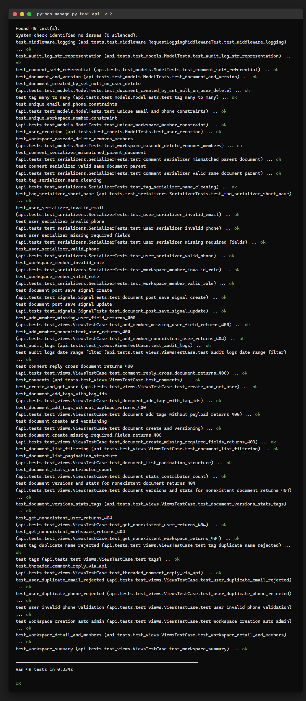

---

## 3. What a Failing Test Looks Like (Demonstration)

To document both outcomes, `test_tags` was **temporarily** changed to assert an intentionally wrong status code (`418` instead of the real `201`), the suite was re-run to capture genuine Django test-runner failure output below, and the change was **immediately reverted** — this was a one-off demonstration, not a real defect.

```text
test_tags (api.tests.test_views.ViewsTestCase.test_tags) ... FAIL

======================================================================
FAIL: test_tags (api.tests.test_views.ViewsTestCase.test_tags)
----------------------------------------------------------------------
Traceback (most recent call last):
  File "C:\Users\Dell\OneDrive\Desktop\Assignment\CollabDocs\api\tests\test_views.py", line 212, in test_tags
    self.assertEqual(res.status_code, status.HTTP_418_IM_A_TEAPOT)  # TEMP: intentionally wrong, for failure-output demo
    ~~~~~~~~~~~~~~~~^^^^^^^^^^^^^^^^^^^^^^^^^^^^^^^^^^^^^^^^^^^^^^
AssertionError: 201 != 418

----------------------------------------------------------------------
Ran 49 tests in 0.336s

FAILED (failures=1)
```

Key things this demonstrates:

- Django's test runner marks the specific test `FAIL` inline in the verbose list, then prints a full traceback with the exact file, line number, and an `AssertionError` showing *actual != expected*.
- The overall run summary switches from `OK` to `FAILED (failures=N)` and the exit code becomes non-zero (what CI uses to block a merge).
- After reverting the intentional change, the suite returns to 49/49 passing — reconfirmed immediately below.

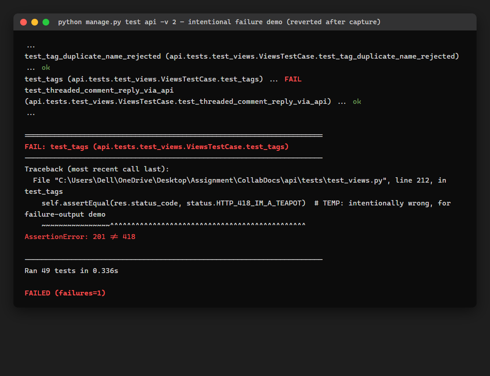

### Reverted — back to 49/49 passing

```text
----------------------------------------------------------------------
Ran 49 tests in 0.249s

OK
```

---

## 4. Live API Verification via Swagger UI

Beyond the automated suite, the running API was exercised live through Swagger UI (`http://127.0.0.1:8000/api/schema/swagger-ui/`) to visually confirm behavior that automated tests assert programmatically. All screenshots below are embedded directly (not external links).

### 4.1 Swagger UI & ReDoc render correctly

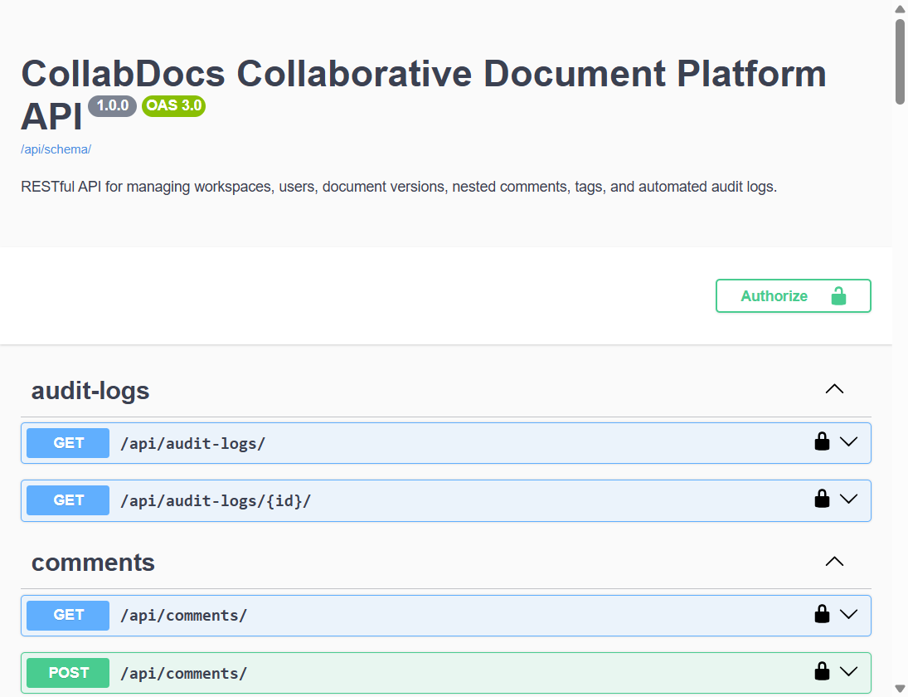

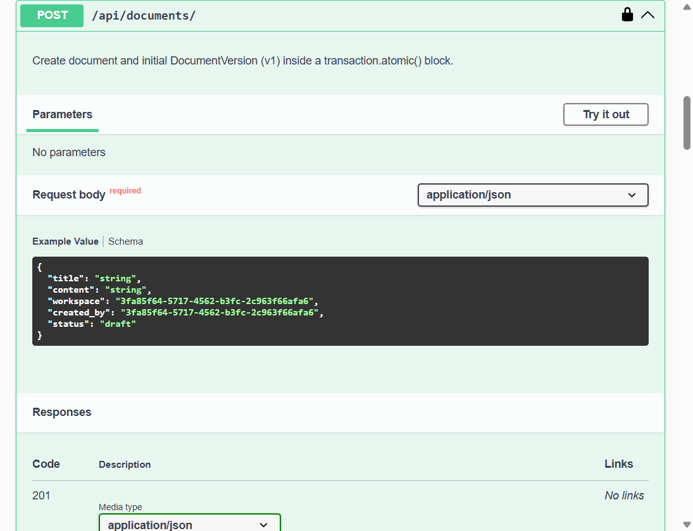

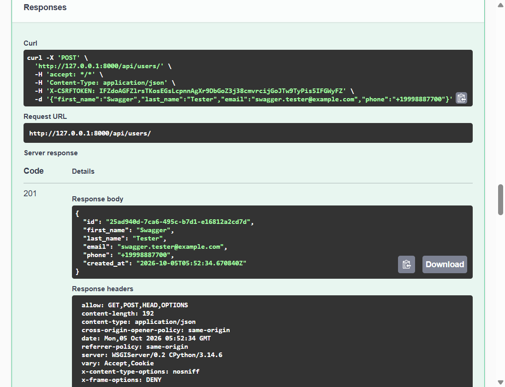

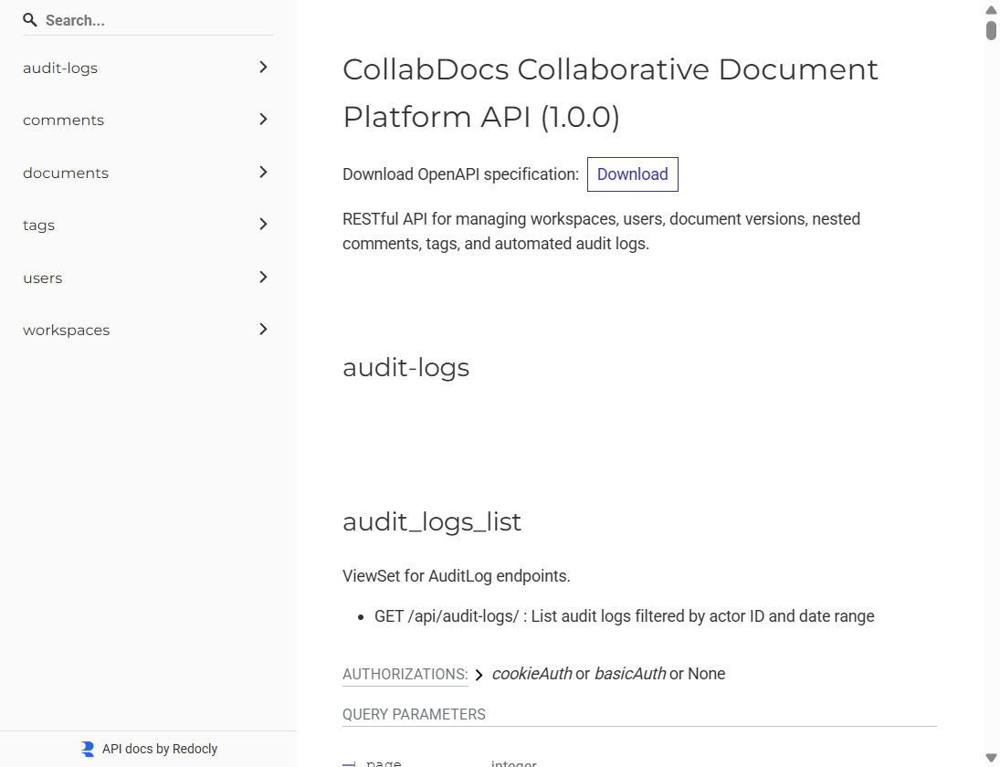

### 4.2 Atomic transaction with rollback on failure

`WorkspaceViewSet.members()` wraps `WorkspaceMember.objects.create(...)` in `transaction.atomic()`. Adding the same user to the same workspace twice violates the `unique_workspace_member` constraint, raising `IntegrityError` mid-transaction; the view catches it and rolls back, returning `409 Conflict` with no partial write.

**Step 1 — first add succeeds (`201 Created`):**

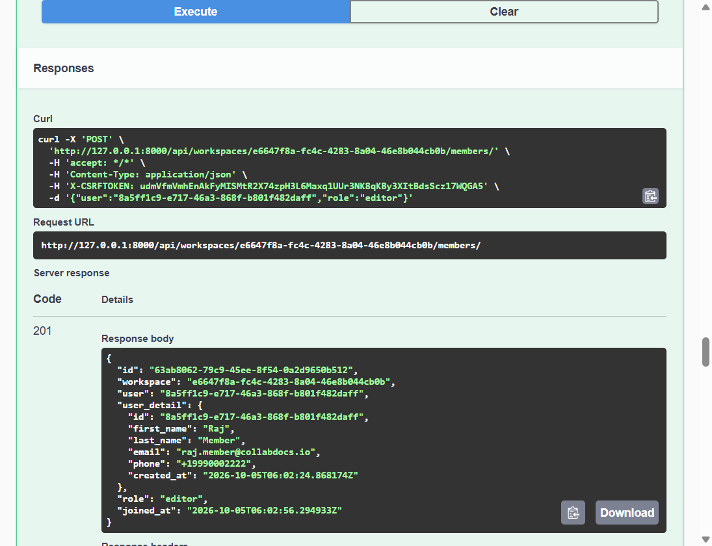

**Step 2 — repeating the same request triggers the rollback (`409 Conflict`):**

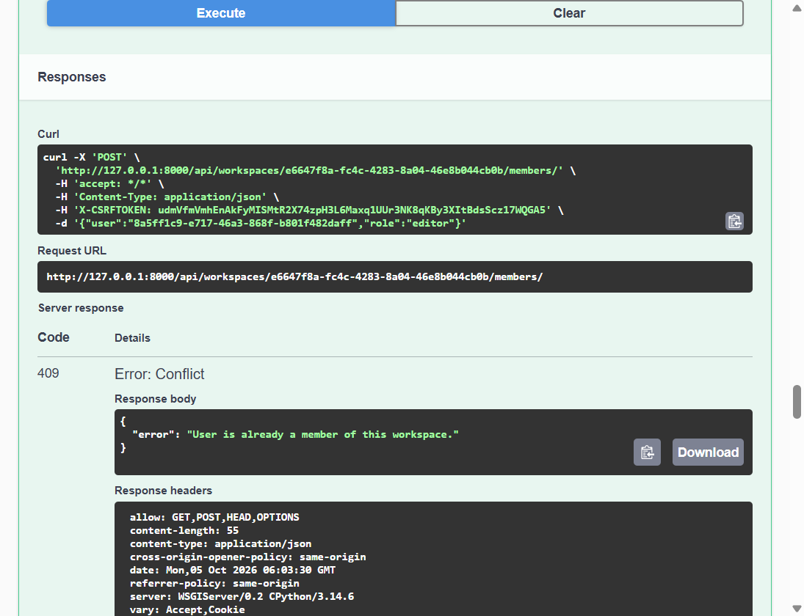

**Step 3 — member list confirms no duplicate row was persisted:**

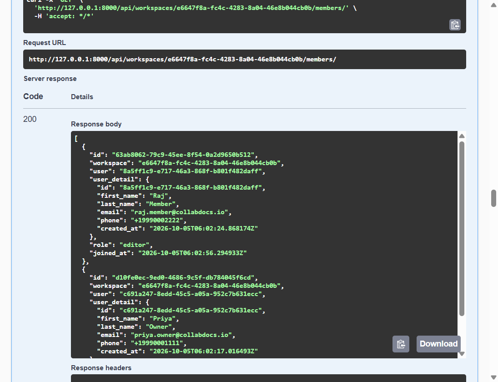

### 4.3 Middleware request logging in the console

`collabdocs/middleware.py`'s `RequestLoggingMiddleware` prints `[METHOD] path - Status: <code> - Time taken: <ms>ms` to the console for every request. This is captured directly from the `runserver` console while the Swagger UI requests above were executed:

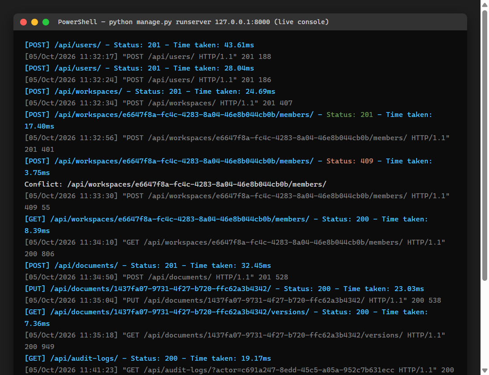

### 4.4 Aggregation endpoints (stats / summary)

`GET /api/documents/{id}/stats/` returns `version_count`, `comment_count`, and `contributor_count` computed via Django ORM aggregation:

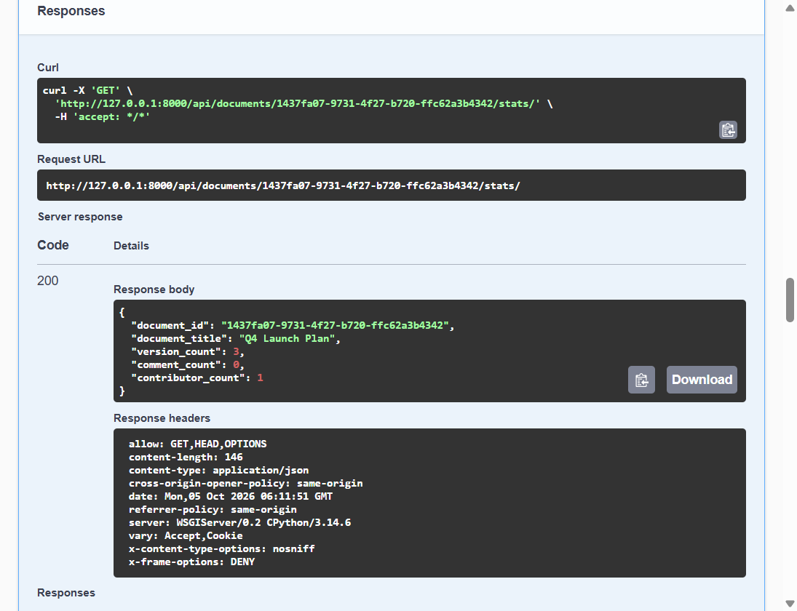

`GET /api/workspaces/{id}/summary/` returns `document_count`, `member_count`, and `total_comments`:

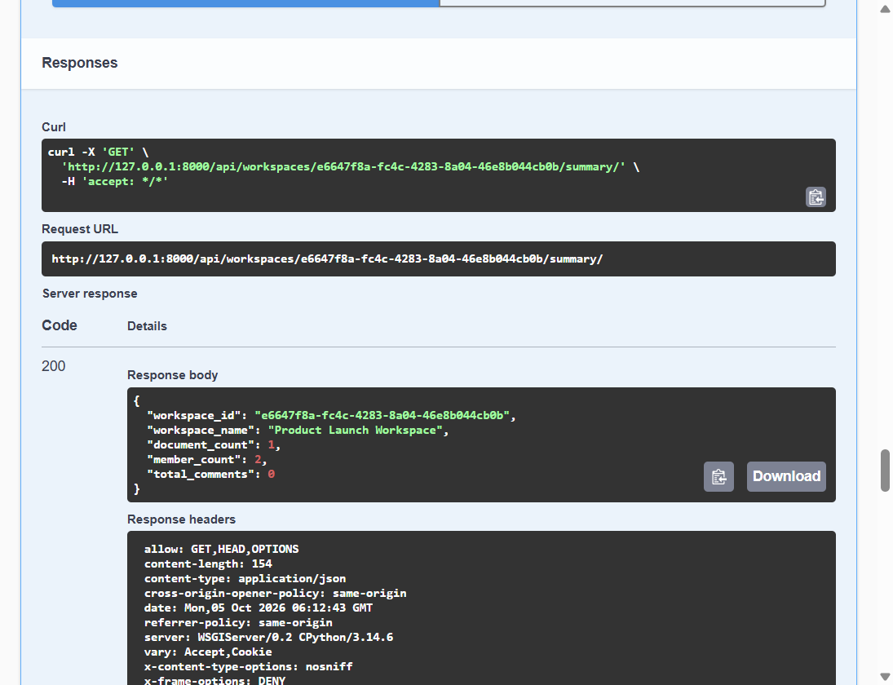

### 4.5 `AuditLog` written by the signal after a document update

A `post_save` signal on `Document` writes an `AuditLog` row on every create (`action="created"`) and update (`action="updated"`). After creating a document (v1) and updating it twice (v2, v3), `GET /api/audit-logs/?actor={id}` returns 3 entries: 1 `created` + 2 `updated`, each referencing the same `object_id`:

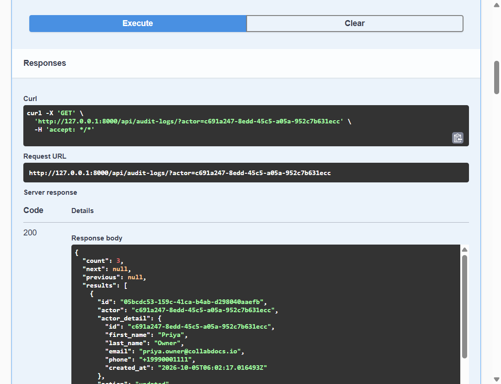

### 4.6 Document update showing the corrected `version_count`

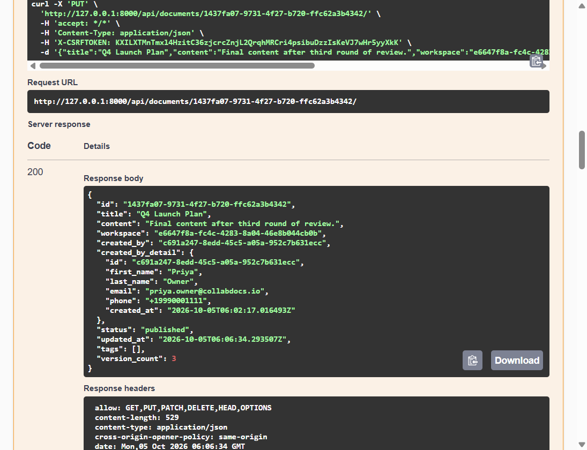

---

## 5. Bugs Found and Fixed During Verification

While exercising the scenarios above through Swagger UI, two real issues were found and fixed (both are now covered by automated regression tests in `api/tests/test_views.py`):

1. **Stale `version_count` after `PUT /api/documents/{id}/`** — `DocumentViewSet.get_queryset()` prefetches `versions`, so after creating a new `DocumentVersion` inside `update()`, the serializer's `version_count` field read the *stale* prefetch cache instead of the new count. Fixed by clearing `document._prefetched_objects_cache['versions']` before serializing the response in `api/views.py`.
2. **Undocumented filter query parameters in Swagger UI** — `workspace`/`status`/`tag_name`/`search` (documents), `document` (comments), and `actor`/`date_from`/`date_to` (audit logs) were implemented via `request.query_params` but never declared to drf-spectacular, so they were unusable from Swagger UI's **Try it out** panel. Fixed by adding `@extend_schema_view(list=extend_schema(parameters=[...]))` to `DocumentViewSet`, `CommentViewSet`, and `AuditLogViewSet` in `api/views.py`.

---

## 6. Live API Verification via Postman

The same four demo-video scenarios verified through Swagger UI in Section 4 were also verified through **Postman**, using the actual [CollabDocs.postman_collection.json](../CollabDocs.postman_collection.json) file.

### 6.1 Setting it up

Two ways to run the collection are documented below: the Postman desktop/GUI app (manual, what you'd do day-to-day) and `newman` — Postman's own official CLI collection runner — which was used here to execute the *real* collection file against the running server and capture genuine, reproducible evidence for this document.

**Option A — Postman desktop app (GUI)**

1. Install [Postman](https://www.postman.com/downloads/) and open it.
2. Click **Import** → select **CollabDocs.postman_collection.json** from the repository root.
3. Open the collection's **Variables** tab and set `baseUrl` to `http://127.0.0.1:8000/api` (leave `userId`, `workspaceId`, `documentId` blank — they get filled in manually as you go).
4. Start the API: `python manage.py runserver 127.0.0.1:8000`.
5. Run **Users → Create User**, copy the `id` from the response into the `userId` collection variable.
6. Run **Workspaces → Create Workspace (Auto-adds Owner as Admin)**, copy its `id` into `workspaceId`.
7. Run **Workspaces → Add Member to Workspace** — since the sample body reuses `{{userId}}` as the member, this call duplicates the workspace owner and returns `409 Conflict` (the atomic-rollback scenario, see 6.2).
8. Run **Documents → Create Document + Version 1 (Atomic)**, copy its `id` into `documentId`.
9. Run the remaining requests in each folder (**Documents → Update...**, **Comments**, **Tags**, **Audit Logs**) in order — every `{{documentId}}`/`{{workspaceId}}`/`{{userId}}` placeholder now resolves automatically.
10. Watch the terminal running `runserver` for the middleware log lines as each request completes (see 6.3).

**Option B — `newman` CLI (used to generate the evidence below)**

Because this environment only has browser automation (no desktop-GUI automation), the collection was instead executed with `newman` — Postman's official command-line collection runner, which uses the same request engine as the desktop app (note the `PostmanRuntime/7.39.1` `User-Agent` header visible in every screenshot below).

```bash
# 1. Install Node.js (provides npm), then install newman + the HTML report plugin
npm install -g newman newman-reporter-htmlextra

# 2. Start the API
python manage.py runserver 127.0.0.1:8000

# 3. Run the full collection against the live server
newman run CollabDocs.postman_collection.json \
  --env-var "baseUrl=http://127.0.0.1:8000/api" \
  --reporters cli,htmlextra \
  --reporter-htmlextra-export newman-report.html
```

Because the shipped collection has no chaining test-scripts (it's designed for manual variable copy-paste in the GUI, per Option A), a temporary copy was used for the CLI run with three one-line `pm.collectionVariables.set(...)` test scripts added to **Create User**, **Create Workspace**, and **Create Document** so `{{userId}}`/`{{workspaceId}}`/`{{documentId}}` resolve automatically across all 17 requests in one pass — the committed `CollabDocs.postman_collection.json` itself was **not modified**.

### 6.2 Atomic transaction with rollback on failure

The collection's own sample data for **Add Member to Workspace** reuses the workspace owner's `userId` as the member being added — which is exactly the duplicate-member scenario that triggers the `transaction.atomic()` rollback and `409 Conflict`.

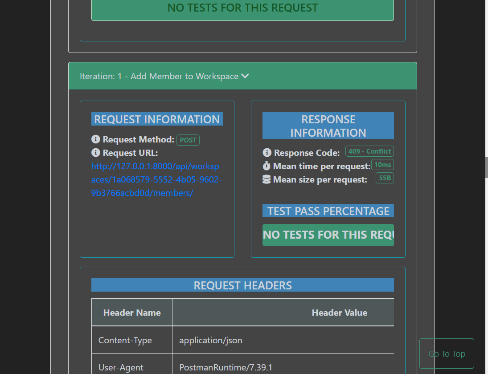

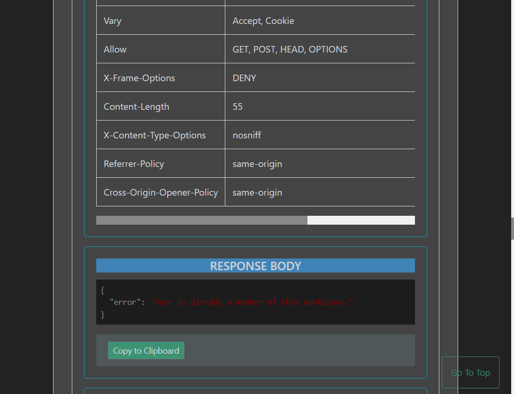

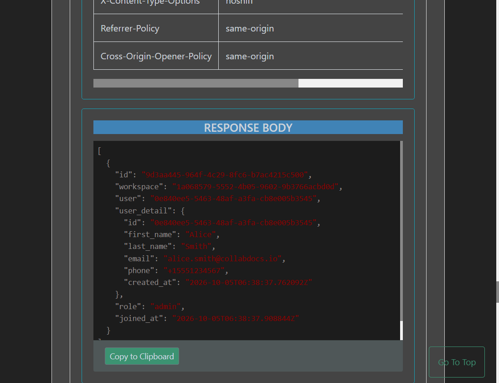

### 6.3 Middleware request logging in the console

The same `[METHOD] path - Status - Time taken` lines appear in the `runserver` console regardless of which client sent the request — Swagger UI, Postman, or `newman`:

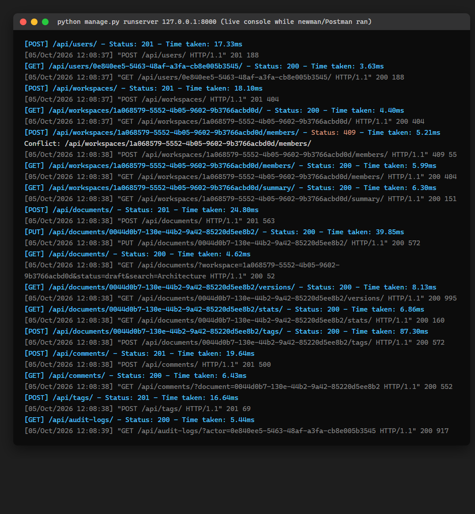

### 6.4 Aggregation endpoints (stats / summary)

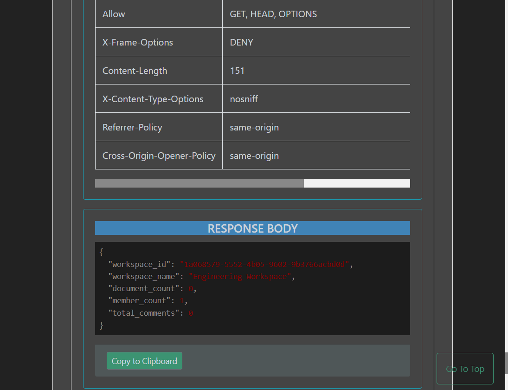

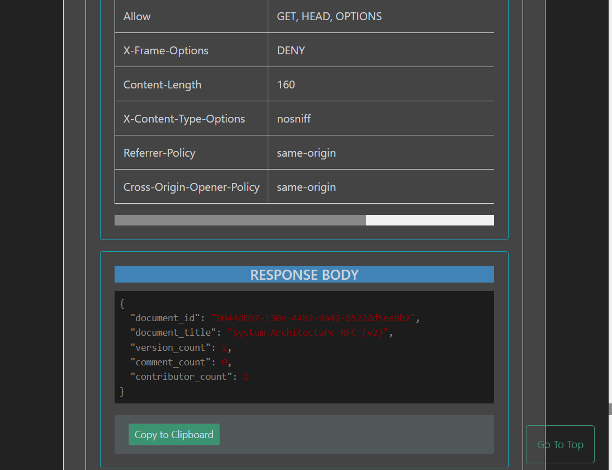

### 6.5 `AuditLog` written by the signal after a document update

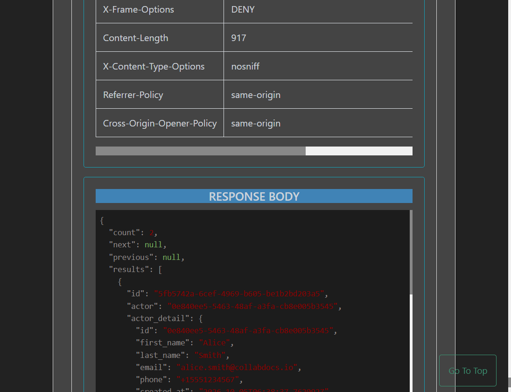

### 6.6 Full collection run report

All **17 requests** executed successfully (0 request failures) in a single `newman` run, organized into the same `Users` / `Workspaces` / `Documents` / `Comments` / `Tags` / `Audit Logs` folders as the committed collection:

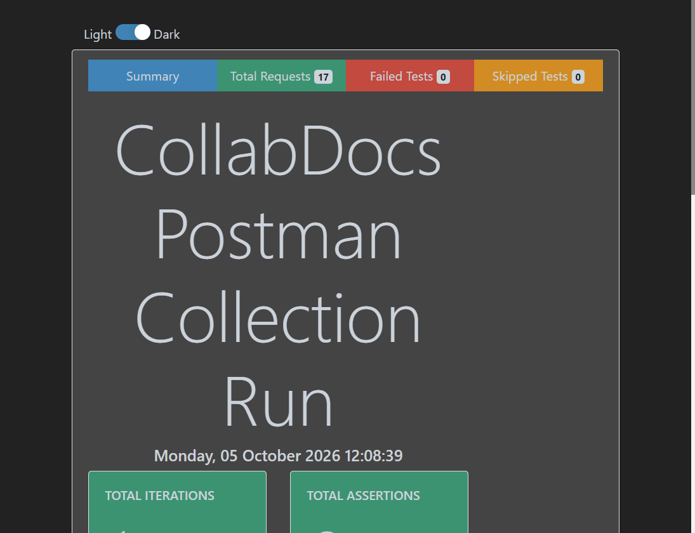

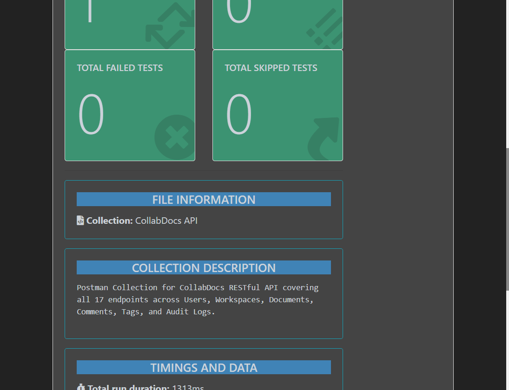

---

## 7. Project Initialization Walkthrough (Screenshots)

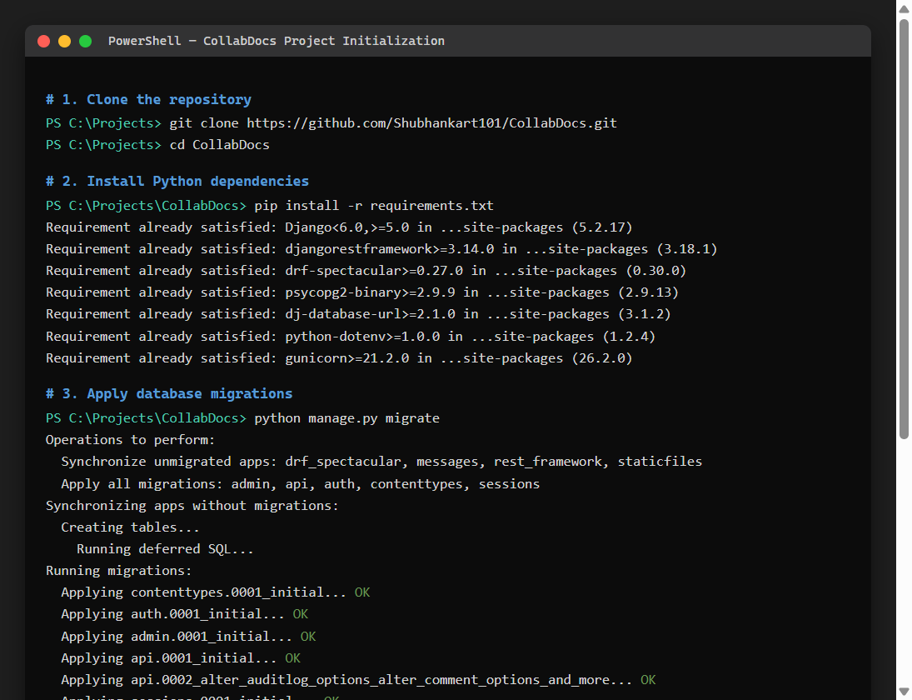

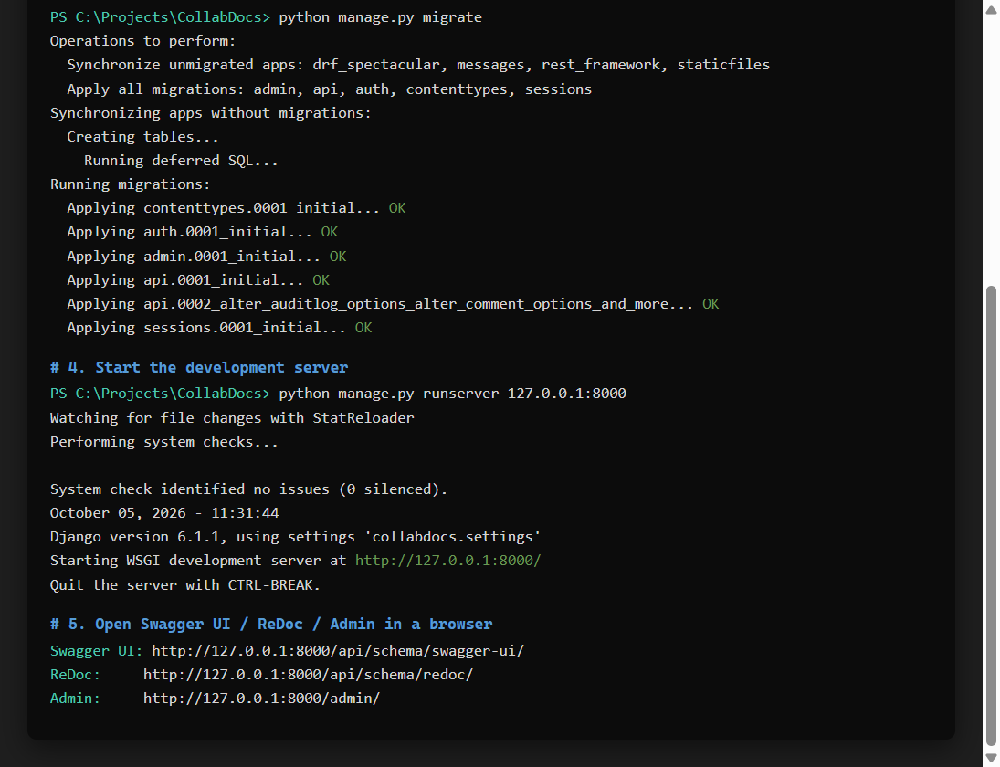

---

## 8. Postman Collection Reference

[CollabDocs.postman_collection.json](../CollabDocs.postman_collection.json) at the repository root covers all 17 endpoints, organized into the `Users`, `Workspaces`, `Documents`, `Comments`, `Tags`, and `Audit Logs` folders, with sample request bodies for every `POST`/`PUT` endpoint. See Section 6.1 above for the full setup procedure.
